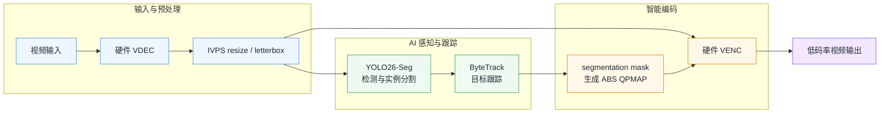
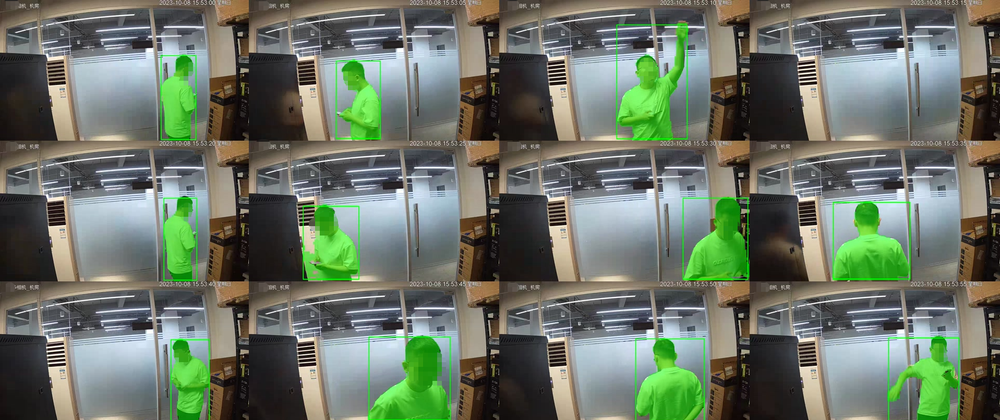

# 智能编码

## 一、简介

监控画面里，人和车可能只占 20% 的区域；仓库、机房、园区的大部分背景，几十秒甚至几分钟都没有明显变化。但传统编码器并不知道什么是“人”、什么是“车”，更不知道哪些区域值得保留细节——它只看到一整张像素矩阵，然后尽可能平均地分配码率。

结果通常只有两种：

- **码率给高了**：人物很清楚，墙面、地板、货架也一起被高质量编码，存储和带宽成本居高不下；
- **码率压低了**：背景是省下来了，但人脸、车辆和行为细节也跟着变糊，关键画面反而最先丢失。

当然，你可以使用固定 ROI、手动画框或者基于规则的区域编码。但摄像头中的目标会移动、遮挡、进出画面，固定区域很快就会失效。想让编码器持续知道“哪里重要”，就必须让它具备视觉理解能力。

智能编码技术采用差异化编码的方式降低码率，即前景正常编码，对背景进行深度优化，来达到不降低视频中人，车，非机动车等目标质量的情况下降低视频体积。

相比其他硬件方案，爱芯的高性能NPU能满足多路视频下segmentation模型的实时处理，从而实现对目标的像素级分割，相比普通矩形框的范围识别更进一步的节约码率。实测在AX8850N上可以实现20路1080P@30fps的转码能力。

## 二、工作方式

### 1. 数据流图

智能编码是一套复杂的流程，它把硬件视频编解码、YOLO26-Seg 实例分割、ByteTrack 多目标跟踪和 VENC ABS QPMAP 组合成一条完整链路：



### 2. 方案核心

智能编码方案依靠YOLO26-Seg的结果来生成对应的qpmap值，为了保持质量和性能的最优解本方案做了三层处理：

1. **YOLO26-Seg 找到目标**：不仅输出 bbox，还输出每个目标的实例分割 mask；
2. **ByteTrack 维持目标身份**：即使不是每一帧都运行检测，也能在中间帧保持目标轨迹；
3. **mask 驱动 QPMAP**：编码器保护的不是一个粗糙固定矩形，而是随目标移动和形变更新的区域。

本方案保留的目标类别包括：

```text
person
bicycle
car
motorcycle
bus
train
truck
```

在默认配置中：

```text
I frame QP:        38
P/B frame QP:      40
ROI QP delta:      -4
GOP:               150
YOLO skip:         5
```

对 P/B 帧来说，背景区域使用 PQP，而 segmentation mask 覆盖区域使用：

```text
ROI QP = clamp(PQP + delta, 0, 51)
```

默认参数下，相当于：

```text
背景 QP = 40
目标区域 QP = 36
```

QP 更低，意味着人物和车辆区域可以获得更高的编码质量；背景仍然维持更高压缩率。I 帧则保持整帧 IQP，不叠加 segmentation delta。

这套机制的关键不是“给一个框降低 QP”，而是：

> **检测、跟踪、mask 传播和编码器 QPMAP 始终处于同一条实时数据流中。**

X-smartVenc 支持将 segmentation mask 和 bbox 直接绘制到输出视频：

```bash
./smartVenc_CLI \
    -i input.mp4 \
    -o output.mp4 \
    --iqp 38 \
    --pqp 40 \
    --gop 150 \
    --conf 0.25 \
    -x 1
```

下面这组连续取样画面不是离线脚本后处理，也不是单独的模型可视化，而是从 AX650 使用 `-x 1` 实际编码输出中直接截取的画面：



绿色区域是 YOLO26-Seg 输出并经过跟踪维护的目标 mask，绿色矩形是对应 bbox，在QPMAP中对mask区域的QP值进行调优，保证目标的清晰度。

## 三、AX8850N 实测：20 路 1080p，626.18 FPS

智能编码的测试不是单独执行 YOLO，也不是绕过编码器只跑前处理，而是完整执行：

```text
FFmpeg demux
→ Annex-B BSF
→ VDEC Send/GetFrame
→ IVPS
→ YOLO26-Seg
→ ByteTrack
→ QPMAP build
→ VENC SendFrame
→ VENC GetStream
→ 码流统计
→ ReleaseStream
```

20 路测试使用：

```bash
./tools/sh/run_20ch.sh 20 --no-output
```

`--no-output` 只是不把码流写成 20 个视频文件，避免 NFS 或磁盘写入干扰纯处理吞吐；VENC GetStream、输出字节统计和 ReleaseStream 仍然完整执行。

### 1. 实测结果

```text
平台:                  AX8850N
输入:                  1920×1080 H.265 MP4
并发进程:              20
每路帧数:              1497
总处理帧数:            29940
成功路数:              20 / 20
进程失败:              0
Aggregate FPS:         626.18
平均每路 FPS:          31.31
最低每路 FPS:          30.83
最高每路 FPS:          32.41
帧数一致性:            1497 - 1497
实时状态:              PASS
```

每路都使用独立的：

```text
VDEC Group ID:   0...19
VENC Channel ID: 0...19
Detector handle
Tracker handle
QPMAP ring
异步 VENC drain
```

最重要的不是某一路偶尔冲到 32 FPS，而是：

- 20 路全部完成；
- 20 路全部处理 1497 帧；
- 没有进程失败；
- 最慢一路仍达到 30.83 FPS；
- 测试结束后没有残留 CLI 进程。

这意味着 智能编码 在 AX8850N 上已经具备面向多路视频分析和智能转码的实际工程基础，而不是只能展示单路效果的算法样例。

### 2. 转得快还不够：20 路转码结果也要一致

多路系统只看 FPS 还不够。如果 20 路使用相同输入和参数，却出现明显不同的码率、压缩倍率或画质指标，就意味着多实例之间可能存在状态串扰、资源竞争或编码控制不稳定。

我们对 AX8850N 20 路默认转码结果逐路计算了文件压缩比、平均码率、PSNR 和 SSIM。质量工具按参考与结果实际可对齐的帧序列进行比较，本次每路均统计到 **1496 个可比帧**。

| Result file                                              | Compression Ratio | Average Bitrate | Frames | PSNR Avg  | PSNR Y    | PSNR U    | PSNR V    | SSIM All | SSIM Y   | SSIM U   | SSIM V   |
| -------------------------------------------------------- | ----------------- | --------------- | ------ | --------- | --------- | --------- | --------- | -------- | -------- | -------- | -------- |
| multich_20_default_v340_20260728_185410/ch01_default.mp4 | 10.719x           | 384.219 kbps    | 1496   | 33.356703 | 31.756055 | 42.430866 | 43.643170 | 0.930709 | 0.906982 | 0.974192 | 0.982136 |
| multich_20_default_v340_20260728_185410/ch02_default.mp4 | 10.728x           | 383.879 kbps    | 1496   | 33.311523 | 31.710069 | 42.404988 | 43.622368 | 0.930233 | 0.906304 | 0.974067 | 0.982114 |
| multich_20_default_v340_20260728_185410/ch03_default.mp4 | 10.723x           | 384.056 kbps    | 1496   | 33.303793 | 31.702052 | 42.411177 | 43.614049 | 0.930124 | 0.906135 | 0.974086 | 0.982115 |
| multich_20_default_v340_20260728_185410/ch04_default.mp4 | 10.700x           | 384.883 kbps    | 1496   | 33.304784 | 31.702966 | 42.412625 | 43.619291 | 0.930127 | 0.906152 | 0.974062 | 0.982091 |
| multich_20_default_v340_20260728_185410/ch05_default.mp4 | 10.734x           | 383.657 kbps    | 1496   | 33.343924 | 31.743144 | 42.423349 | 43.631553 | 0.930584 | 0.906809 | 0.974158 | 0.982107 |
| multich_20_default_v340_20260728_185410/ch06_default.mp4 | 10.707x           | 384.654 kbps    | 1496   | 33.361022 | 31.760594 | 42.437189 | 43.631279 | 0.930784 | 0.907094 | 0.974161 | 0.982167 |
| multich_20_default_v340_20260728_185410/ch07_default.mp4 | 10.698x           | 384.965 kbps    | 1496   | 33.303578 | 31.702062 | 42.402145 | 43.611510 | 0.930109 | 0.906134 | 0.974024 | 0.982092 |
| multich_20_default_v340_20260728_185410/ch08_default.mp4 | 10.706x           | 384.664 kbps    | 1496   | 33.358783 | 31.758023 | 42.433503 | 43.651398 | 0.930751 | 0.907038 | 0.974202 | 0.982153 |
| multich_20_default_v340_20260728_185410/ch09_default.mp4 | 10.718x           | 384.243 kbps    | 1496   | 33.350227 | 31.749543 | 42.426406 | 43.636228 | 0.930642 | 0.906891 | 0.974165 | 0.982128 |
| multich_20_default_v340_20260728_185410/ch10_default.mp4 | 10.716x           | 384.318 kbps    | 1496   | 33.302939 | 31.701229 | 42.408761 | 43.613341 | 0.930113 | 0.906130 | 0.974072 | 0.982091 |
| multich_20_default_v340_20260728_185410/ch11_default.mp4 | 10.707x           | 384.638 kbps    | 1496   | 33.306020 | 31.704483 | 42.406977 | 43.612112 | 0.930144 | 0.906179 | 0.974056 | 0.982094 |
| multich_20_default_v340_20260728_185410/ch12_default.mp4 | 10.747x           | 383.193 kbps    | 1496   | 33.351605 | 31.750815 | 42.436468 | 43.632685 | 0.930626 | 0.906861 | 0.974160 | 0.982153 |
| multich_20_default_v340_20260728_185410/ch13_default.mp4 | 10.735x           | 383.625 kbps    | 1496   | 33.350882 | 31.749967 | 42.441386 | 43.632268 | 0.930627 | 0.906863 | 0.974162 | 0.982151 |
| multich_20_default_v340_20260728_185410/ch14_default.mp4 | 10.706x           | 384.679 kbps    | 1496   | 33.350121 | 31.749312 | 42.436810 | 43.629994 | 0.930621 | 0.906858 | 0.974143 | 0.982153 |
| multich_20_default_v340_20260728_185410/ch15_default.mp4 | 10.694x           | 385.113 kbps    | 1496   | 33.350784 | 31.750040 | 42.432033 | 43.633814 | 0.930621 | 0.906853 | 0.974132 | 0.982181 |
| multich_20_default_v340_20260728_185410/ch16_default.mp4 | 10.707x           | 384.654 kbps    | 1496   | 33.253626 | 31.650775 | 42.384933 | 43.601572 | 0.929591 | 0.905378 | 0.973937 | 0.982093 |
| multich_20_default_v340_20260728_185410/ch17_default.mp4 | 10.698x           | 384.968 kbps    | 1496   | 33.248521 | 31.645144 | 42.398138 | 43.605271 | 0.929917 | 0.905838 | 0.974047 | 0.982102 |
| multich_20_default_v340_20260728_185410/ch18_default.mp4 | 10.703x           | 384.772 kbps    | 1496   | 33.357443 | 31.757029 | 42.431215 | 43.629966 | 0.930732 | 0.907016 | 0.974155 | 0.982174 |
| multich_20_default_v340_20260728_185410/ch19_default.mp4 | 10.728x           | 383.872 kbps    | 1496   | 33.300017 | 31.698398 | 42.403142 | 43.608348 | 0.930081 | 0.906084 | 0.974045 | 0.982106 |
| multich_20_default_v340_20260728_185410/ch20_default.mp4 | 10.737x           | 383.555 kbps    | 1496   | 33.258763 | 31.655912 | 42.396719 | 43.597935 | 0.929632 | 0.905435 | 0.973988 | 0.982064 |

把 20 路数据汇总后，一致性更加直观：

| 指标              |  20 路平均值 |       最小值 |       最大值 |    最大跨度 |
| ----------------- | -----------: | -----------: | -----------: | ----------: |
| Compression Ratio |     10.7156x |      10.694x |      10.747x |      0.053x |
| Average Bitrate   | 384.330 kbps | 383.193 kbps | 385.113 kbps |  1.920 kbps |
| PSNR Avg          | 33.321253 dB | 33.248521 dB | 33.361022 dB | 0.112501 dB |
| PSNR Y            | 31.719881 dB | 31.645144 dB | 31.760594 dB | 0.115450 dB |
| SSIM All          |     0.930338 |     0.929591 |     0.930784 |    0.001193 |
| SSIM Y            |     0.906452 |     0.905378 |     0.907094 |    0.001716 |

几组数字尤其值得注意：

- 20 路平均码率都稳定在约 **384 kbps**，最大差值只有 **1.92 kbps**；
- Compression Ratio 集中在 **10.694x～10.747x**，最大跨度仅 **0.053x**；
- PSNR Avg 的 20 路最大跨度只有 **0.113 dB**；
- SSIM All 的最大跨度只有 **0.001193**；
- 20 路质量评估的可比帧数全部为 **1496**，没有某一路提前结束或少算一段。

因此，AX8850N 的 20 路结果不只是“都跑到了 30 FPS”，还表现出高度一致的码率、压缩倍率和全参考画质指标。对于多路录像、NVR 和边缘视频网关，这种跨通道一致性意味着容量规划更可预测，也说明各实例的编码配置、QPMAP 状态和资源上下文没有出现明显串扰。

## 四、 AXCL支持：Raspberry Pi 5 + 加速卡，10 路 1080p × 25 FPS

智能编码不只支持 AX8850N SoC 板端运行，还支持 AXCL Host 模式。

在 AXCL 模式下，Host 负责应用和媒体 I/O，视频解码、IVPS、NPU 推理与编码由 AXCL 设备完成。项目同时处理了 AXCL 特有的工程问题：

- runtime 初始化与 device index 选择；
- 每个 worker thread 独立绑定 AXCL context；
- raw NV12 Host staging 与 H2D copy；
- ENGINE output D2H copy；
- VENC 码流 D2H copy；
- Host 地址和 device address 的所有权边界。

我们将 AXCL AArch64 版本部署到了 Raspberry Pi 5：

```text
Host:               Raspberry Pi 5
Host architecture:  aarch64
AXCL device ID:     1
Input:              1920×1080 H.265
YOLO interval:      5
```

### 单路结果

```text
单路 --no-output:   119.61 FPS
单路 MP4 输出:      127.80 FPS
输出帧数:           1497
MP4 完整解码:       PASS
```

### 10 路结果

```text
成功路数:           10 / 10
进程失败:           0
每路帧数:           1497
总处理帧数:         14970
Aggregate FPS:      263.69
平均每路 FPS:       26.37
最低每路 FPS:       26.04
最高每路 FPS:       27.14
帧数一致性:         PASS
```

按照视频监控中常见的 25 FPS 口径，这套组合可以稳定支撑：

> **10 路 1080p × 25 FPS 智能编码。**

10 路 profiling 显示，主要压力来自：

| 阶段                   |               单路 |         10 路代表值 |
| ---------------------- | -----------------: | ------------------: |
| ENGINE Output D2H copy | 18.81 ms/inference | 70～75 ms/inference |
| QPMAP build            |      0.40 ms/frame |   5.2～5.8 ms/frame |
| VENC SendFrame wait    |      0.22 ms/frame | 11.7～12.3 ms/frame |
| VENC GetStream wait    |      7.35 ms/frame |     33～34 ms/frame |

这说明瓶颈不在文件读取，而在多路共享时的 AXCL 数据传输和设备编解码队列。树莓派上PCIE2.0X1的速率导致数据搬运时间增大。

## 五、它适合哪些场景？

### 安防监控和园区视频

人、车等关键目标区域保留更多细节，大面积静态背景使用更高压缩率。适合 NVR、边缘服务器和智能摄像机前端。

### 工厂、仓库和机房

生产区域通常背景固定，真正重要的是人员、车辆和运动目标。智能 QPMAP 可以减少无效背景码率，把存储预算用在可追溯的关键区域。

## 六、最后：视频编码不应该只看像素，还应该看内容

过去的视频编码器解决的是一个纯信号问题：如何用更少的字节表达一串图像。

但在今天的安防、工业和边缘 AI 场景里，我们真正关心的从来不是“每个像素都一样清楚”，而是：

- 人有没有看清；
- 车有没有保住细节；
- 关键目标是否可以回溯；
- 在固定带宽和存储预算下，能不能把资源优先留给真正重要的内容。

智能编码给出的答案，是把 AI 和编码器放进同一条实时链路：

```text
看见目标
→ 跟住目标
→ 生成 mask
→ 更新 QPMAP
→ 编码关键区域
```

真实测试数据也给出了清晰的落地边界：

```text
AX650:
20 路 1080p
626.18 aggregate FPS
20/20 成功

Raspberry Pi 5 + AXCL:
10 路 1080p × 25 FPS
263.69 aggregate FPS
10/10 成功
```

这不是一个只会跑模型的样例，也不是一个只会压视频的编码器。

> **它是一套让视频编码真正“理解画面”的边缘智能视频流水线。**

如果你的项目正在面对多路视频、长期存储、关键目标画质、边缘侧部署或 AX8850N/AXCL 跨平台开发，智能编码值得成为下一版视频系统的起点。

## 七、相关链接指引

[智能编码 AX-SmartVenc](https://github.com/AXERA-TECH/AX-SmartVenc)

[AX-SmartVenc 让视频编码真正看懂画面，AX8850N 实测 20 路实时](https://zhuanlan.zhihu.com/p/2069351111463588225)

